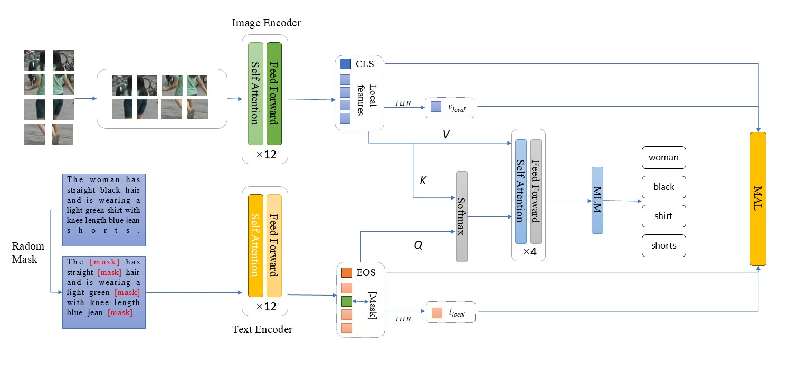
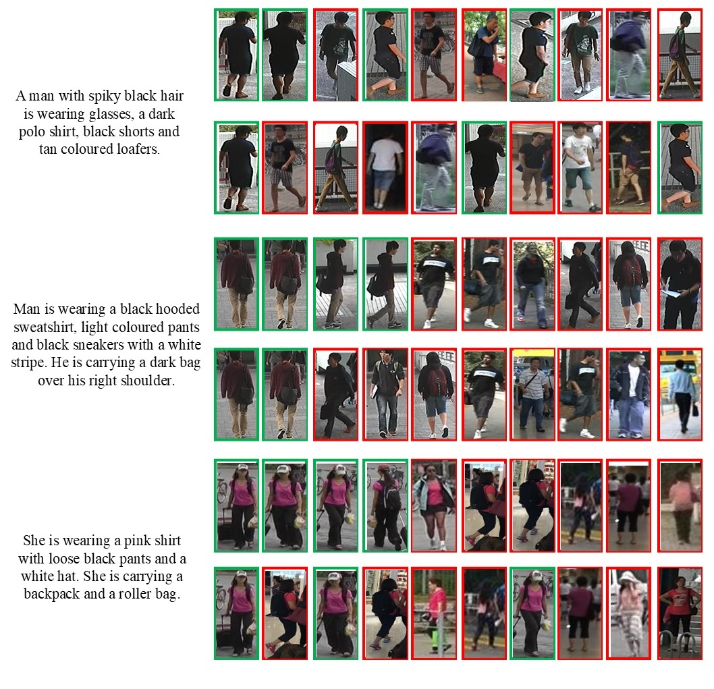

# Cross-Modal Fine-grained Feature Alignment for Text-Based Person Re-identification

## Introduction
Previous TReID works focuse mainly on coarse-grained features while 
neglecting the critical role of fine-grained features 
in identification. To address this limitation, we propose a Cross-Modal Fine-grained
Feature Alignment (CFFA) method. We introduce a Fine-grained Local
Feature Refinement (FLFR) approach to extract essential local 
fine-grained features.
Secondly we adopt an
implicit cross-modal relation reasoning method. It implicitly infers complex relationships 
between textual descriptions and image content.
Then, we propose a Multi-association
Learning (MAL) method to strengthen the model’s ability to distinguish between
positive and negative samples.
Comprehensive evaluations on three
public datasets validate the effectiveness of our CFFA method, demonstrating
superior performance compared to state-of-the-art approaches on key metrics.

## Framework
#### Overview of Framework


## Requirements
- Python 3.10.14
- PyTorch 2.3.0
- torchvision 0.18.0
- cuda 11.8

## Datasets
Download the CUHK-PEDES dataset from [here](https://github.com/ShuangLI59/Person-Search-with-Natural-Language-Description). 

Download the ICFG-PEDES dataset from [here](https://github.com/zifyloo/SSAN).

Download the RSTPReid dataset form [here](https://github.com/NjtechCVLab/RSTPReid-Dataset)

Organize them in `./datasets` folder as follows:
```
|-- datasets/
|   |-- CUHK-PEDES/
|       |-- imgs
|            |-- cam_a
|            |-- cam_b
|            |-- ...
|       |-- reid_raw.json
|
|   |-- ICFG-PEDES/
|       |-- imgs
|            |-- test
|            |-- train 
|       |-- ICFG_PEDES.json
|
|   |-- RSTPReid/
|       |-- imgs
|       |-- data_captions.json
```

## Training
Download the pretrained CLIP checkpoints from [here](https://huggingface.co/openai/clip-vit-base-patch16)

Then run the script
```
sh train.sh
```

## Testing
After training, you can test your model by run:
```
python test.py
```

## Results

[//]: # (#### Results on CUHK-PEDES dataset)

[//]: # (![img.png]&#40;FrameworkAndResults/ResultsOnCUHK-PEDES.png&#41;)

[//]: # ()
[//]: # (#### Results on ICFG-PEDES dataset)

[//]: # (![img.png]&#40;FrameworkAndResults/ResultsOnICFG-PEDES.png&#41;)

[//]: # ()
[//]: # (#### Results on RSTPReid dataset)

[//]: # (![img.png]&#40;FrameworkAndResults/ResultsOnRSTPReid.png&#41;)

#### Qualitative results


## Acknowledgements
Some components of this code implementation are adopted from [IRRA](https://github.com/anosorae/IRRA). We sincerely appreciate for their contributions.


